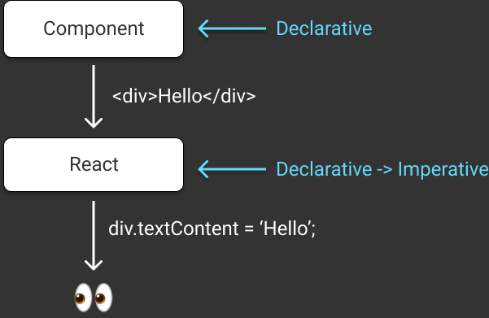

import { Img } from '@fusuma/client';

<!-- note

Let's get started!
The first part is "Declarative Programming for UI"
-->

# Declarative Programming for UI

---------------

<!-- note
ここではWikipediaから引用しています

On this slide, we have the Wikipedia definition of Declarative Programming.
Please take a look at these two points in bold
because they are important to understand what Declarative Programming is.
"the logic of a computation without describing its control flow"
"describing what the program must accomplish in terms of the problem domain"
-->

# Declarative Programming

> In computer science, declarative programming is a programming paradigm—a style of building the structure and elements of computer programs—that expresses **the logic of a computation without describing its control flow**.

> Many languages that apply this style attempt to minimize or eliminate side effects by **describing what the program must accomplish in terms of the problem domain**, rather than describe how to accomplish it as a sequence of the programming language primitives

https://en.wikipedia.org/wiki/Declarative_programming

---------------

<!-- note
宣言的に書くことでHowをコンパイラーに任せることが出来て、抽象化層を作ることが出来ます

With Declarative Programming, you write what you want to do rather than how you want to do it.
How is a job for a compiler, not for you.

It also creates an abstraction layer that is declarative.
The abstraction layer hides an underlying layer that manages how to do it.
So a compiler can optimize on the underlying layer.

In addition to that, you can define primitives in the declarative layer as domain logic.
So it makes it possible to provide a high level abstraction.
-->

# Why Declarative?

- What Not How
    - How -> Compiler
- Abstraction layer
    - Optimization in the underlying layer
    - Primitive as domain

---------------

<!-- note
Let's briefly go back to the Wikipedia definition
"The logic of a computation without describing its control flow"
-->


> The logic of a computation without describing its control flow

---------------

<!-- note
でもDOMは命令的なAPIです

For application running on browsers, DOM is primitive and you would write DOM manipulations to update your views.
As you may know, DOM manipulation is based on imperative operations.
-->

# DOM manipulation is based on imperative operations

---------------

<!-- note
これはその例です

Let's take a look at an example.
This is an imperative operation and describes how to update the view, not what the view should be.

They change the DOM based on the caller DOM objects so the results depend on the caller itself not only the arguments.
-->

# Imperative

```js
const view = document.querySelector('.view');
const addButton = document.querySelector('.add-button');

// You have to implement how to update the view
addButton.addEventListener('click', () => {
    view.appendChild(child)
});
```

---------------

<!-- note
これは宣言的に書いた例です

Let's now look at the declarative version.

This becomes longer than the imperative version.

the render function displays the view, which describes what the view should be, not how to update the view.
So the render function is declarative, which is based on the passed state.
Of course, we still need an imperative operation to update the state.
But the state update part is now separated from the view.
-->

# Declarative

```js
const view = document.querySelector('.view');
const addButton = document.querySelector('.add-button');
const state = [];

addButton.addEventListener('click', () => {
    // update the state impleratively
    state.push(child);
    // describe the view declaratively based on the state
    render(state);
});

// describing what the view should display
const render = state => {
    view.innerHTML = state.map(s => `<span>${s}</span>`).join('');
}
```

Describing what to update the view

---------------

<!-- note
宣言的に書くことでViewをただの関数として考えることが出来ます

You can update a state imperatively and you can update a view declaratively, which are loose coupling.
View is just a function.
You can think of them like a server-rendered app.
Mutation is only for state, not for views, which means we can write tests for state and views easily.

But...
Do you create an entire view with each update...?
-->

# 👀 = View(State)

----------------------

<!-- note
Reactは差分更新によりそれを可能にしています

No, React updates views efficiently.
React calculates the diffs and then applies them to the view.
So we don't have to worry about scroll position, focus management and so on.

Please take a look at the slide,
This updates the textContent of p element only.
So in the second render, React calculates the diff between the render functions,
and applies the diff by p.textContent = 2;
-->

# React updates views efficiently

```js
let count = 1;
ReactDOM.render(
    <div>
        <Header />
        <p>{count}</p>
    </div>,
    container
);

count = 2;
ReactDOM.render(
    <div>
        <Header />
        <p>{count}</p>
    </div>,
    container
)
// p.textContent = 2; // React updates the DOM
```

a.k.a. Virtual DOM

----------------------

<!-- note
React transforms diffs to imperative operations

So we are able to write components declaratively without worrying about actual imperative operations.
React does this for you.

As a result, we don't have to write how to change the view.
We can focus on what the view should be.

In other words, if you want to create a custom renderer,
you have to implement how.
-->

# ReactDOM Renderer



----------------------

<!-- note
Let's briefly go back to the Wikipedia definition
"Describing what the program must accomplish in terms of the problem domain"
-->

> Describing what the program must accomplish in terms of the problem domain

----------------------

<!-- note
DOMの上に抽象化のレイヤーを作ることは考えてみます。

When we write a div as JSX, it's not a DOM, It's a React Element.
React creates an abstraction layer using React Element on top of the DOM.

But the abstraction level might be too low as primitives for your application.
You can build your abstraction layer on top of the ReactDOM.
It makes your applications clean and maintains consistency.
-->

# Abstract your application components

- DOM is an implementation detail
- React Component is a primitive of your domain.

----------------------

<!-- note
ここでは、DOMの上にアプリケーションコンポーネントのレイヤーを構築しています

Let's take a look.

This App isn't using any DOM Components directly.
It uses components that I've created.

This makes it possible to hide many details like styles, markups and so on.
Of course you have to create these primitive components like Layout, Button, List, and so on, but developers who create an application don't care about these.
They just use them.

Designing your primitive components is very hard.
Which props should be exposed or not...

If primitive components are too high-level abstractions, they wouldn't be used because they are not covered developer's usecases...
If primitive components are leaking details unnecessarily, the application would lose consistency...

So thinking about your domain primitives is your job,
it's very hard but important.
-->

# Build own domain layers with React

```js
const view = document.querySelector('.view');

// describing what the view should display
const App = () => {
    const [items, setItems] = useState([]);
    return (
        <Layout>
            <Header>title</Header>
            <ItemList>
                {items.map(item => <Item key={item.id} item={item} />)}
            </ItemList>
            <AddItemButton
                onAddItem={item => setItems(items.concat(item))}
            />
        </Layout>
    );
}

ReactDOM.render(<App />, view);
```

----------------------

<!-- note
Here is a great talk about this topic.
I recommend watching the video when you have time.
-->

# DOM as a Second-class Citizen

<Card>
<iframe width="560" height="315" src="https://www.youtube.com/embed/Zemce4Y1Y-A" frameborder="0" allow="accelerometer; autoplay; encrypted-media; gyroscope; picture-in-picture" allowfullscreen></iframe>
</Card>

Sebastian Markbåge / React Europe 2015
