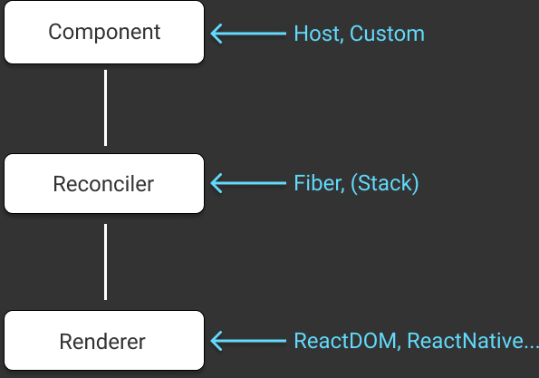

<!-- note
Before explaining Custom Renderer, I'd like to introduce existing renderers.
-->

# React Custom Renderer

----------------------

<!-- note
I guess that you already know `react-native`, `react-test-renderer`.
There are more renderers that are for various environments.

So I'd like to introduce these renderers briefly.
-->

# Renderers

- `react-native` ... Native Apps
- `react-test-renderer` ... For testing components
- `ink` ... CLI Output
- `react-konva` ... Canvas
- `react-three-fiber` ... Threejs
- `react-ast` ... AST

and so on...

----------------------

<!-- note
React Native is a renderer for Native Apps like iOS and Android.
Of course, This is implemented as a custom renderer.

React Native has a project for a new architecture called Fabric,
which uses Persistence mode for custom renderer.

React Native provides primitive components like View, Text, Image and so on.
-->

# ReactNative

```js
<View
    style={{
        flex: 1,
        justifyContent: "center",
        alignItems: "center"
    }}
>
    <Text style={{ fontSize: 50 }}>
        Hello, world!
    </Text>
</View>
```

----------------------

<!-- note
Ink is a custom renderer for CLI output.
This makes it easy to create interactive command line applications.

Ink provides primitive components like Box, Text, Static, and so on.
-->

# Ink

```js
import React from 'react';
import {render, Box, Color} from 'ink';

render(
  <Box>
      <Color green>Hello world!</Color>
  </Box>
);
```

----------------------

<!-- note
React Konva is a custom renderer for Canvas.
This makes it possible to draw canvas graphics declaratively.
React Konva provides primitive components like Stage, Layer, Text and so on.
-->

# ReactKonva

```js
ReactKonva.render(
    <Stage width={100} height={100}>
        <Layer>
            <Text text="Hello world!" />
        </Layer>
    </Stage>,
    el
);
```

---------------

<!-- note
React Three Fiber is a custom renderer for Three.js.
This makes it possible to draw 3D graphics declaratively.

React Three Fiber provides primitive components like mesh, boxBufferGeometry, meshNormalMaterial, and so on.
-->

# ReactThreeFiber

```js
import React, { useRef } from 'react'
import ReactDOM from 'react-dom'
import { Canvas, useFrame } from 'react-three-fiber'

const Cube = () => {
    const ref = useRef()
    useFrame(() => (ref.current.rotation.x = ref.current.rotation.y += 0.01))
    return (
        <mesh ref={ref}>
            <boxBufferGeometry attach="geometry" args={[1, 1, 1]} />
            <meshNormalMaterial attach="material" />
        </mesh>
    )
}
ReactDOM.render(<Canvas><Cube /></Canvas>, el);
```


---------------

<!-- note
This is an interesting renderer.
React AST is a custom renderer for AST. What??

You can define an abstract syntax tree declaratively as JSX.
This can generate source code and an AST object from JSX.

This provides primitives components like ClassDeclaration, FunctionDeclaration, FunctionDeclaration, and so on.
I'm not sure whether it's useful or not.
But It's fun!
-->

# ReactAST

```js
import React from 'react';
import {
    renderAst,
    Code,
    ClassDeclaration,
    FunctionDeclaration
} from 'react-ast';

const ast = renderAst(
    <ClassDeclaration name="Hello" superClassName="Array">
        <Code>const hello = 'world'</Code>
        <FunctionDeclaration name="foo">
            <Code>return 'bar'</Code>
        </FunctionDeclaration>
    </ClassDeclaration>
);

console.log(ast);
```

---------------
<!-- note
Custom renderer is useful even on browser environments.
If you feel that The size of React DOM is so big.
You can create alternative lightweight React DOM implementation as a custom renderer.

ReactDOMLite is an example of these.
If you are interested in creating a custom renderer for DOM.
I recommend watching the video of Sophie's talk at this year's React Conf.

Before describing custom renderer, I'd like to introduce
-->

# React DOM Lite

- https://github.com/jquense/react-dom-lite
- Building a Custom React Renderer
    - https://conf.reactjs.org/event.html?sophiebits

---------------


<!-- note
This is the overview of the architecture of React.

Component is a layer to define components.
Host components are provided by a renderer.
ReactDOM provides DOM components as its host components.
these components start with a lower case.

Custom components are built by application developers.
These are what you create for your applications.

Reconciler is a layer of React core.
It schedules updates and calls host config functions.
It makes possible many features like Hooks, Suspense, and Concurrent Mode.

Finally, Renderer is a layer to implement anything that depends on a host environment.
So when we create a custom renderer, we have to implement this layer.

In other words, you can enable Hooks, Suspense, and Concurrent Mode on your custom renderer without implementing them yourself.
-->

# Architecture of React




---------------
<!-- note
If you are interested in the architecure, please see the slide I presented last year at this link.
-->

# Algorithms in React

- https://speakerdeck.com/koba04/algorithms-in-react


---------------

<!-- note
Ok, It's time to imeplement a custom renderer!

First, we have to install `react-reconciler` package from npm.
-->

# react-reconciler

```shell
npm install react-reconciler
```

[packages/react-reconciler](https://github.com/facebook/react/tree/master/packages/react-reconciler)


---------------

<!-- note
And then, we can create a renderer by passing a hostconfig to the reconciler.
I'll focus on the interface of host config.

After creating a renderer, we create a container of a rendering at the first rendering.
After that, we update the container in order to render the passed element.

Next, let's see the host config interface.
-->

# How to use

```js
import Reconciler from "react-reconciler";

const renderer = Reconciler(hostconfig);

export const YourReact = {
  render(
    element: React.ReactNode,
    rootContainer: RootContainer,
    callback = () => {}
  ) {
    if (!rootContainer.container) {
      rootContainer.container = {}
      rootContainer.container.fiberRoot = renderer.createContainer(
        container,
        false,
        false
      );
    }
    renderer.updateContainer(element, container.fiberRoot, null, callback);
  }
}
```

---------------

<!-- note
You have to implement many interfaces to create a custom renderer.
These are the interfaces.

The first part is the interfaces you must implement.
The second part is an optional interfaces related to mutation.

#1 means that there is a #2...
-->

# HostConfig Interface \#1


> getPublicInstance, getRootHostContext, getChildHostContext, prepareForCommit, resetAfterCommit, createInstance, appendInitialChild, finalizeInitialChildren, prepareUpdate, shouldSetTextContent, shouldDeprioritizeSubtree, createTextInstance scheduleDeferredCallback, cancelDeferredCallback, setTimeout, clearTimeout, noTimeout, now, isPrimaryRenderer supportsMutation, supportsPersistence, supportsHydration


### Mutation(optional)

> appendChild, appendChildToContainer, commitTextUpdate, commitMount, commitUpdate, insertBefore, insertInContainerBefore, removeChild, removeChildFromContainer,  resetTextContent

---------------

<!-- note
Let's move on #2.
The first part includes optional interfaces related to persistence.
If you'd like to impelement your custom renderer as persistence, you have to implement these interfaces.
The persistence mode is a mode to treat the instances as immutable.

React Native Fabric is a renderer enabling persistence mode.

The second part is an optional interfaces related to hydration.
If you'd like to support hydration on your renderer, you have to implement these interfaces.

I won't talk about Persistence and Hydration mode in this talk.
So if you are interested in the modes,
Please see the HostConfig of ReactNativeFabrice to understand the persistence mode, the HostConfig of ReactDOM to understand the hydration mode.

These interfaces are from @types/react-reconciler
-->

# HostConfig Interface \#2

### Persistence(optional)

> cloneInstance, createContainerChildSet, appendChildToContainerChildSet, finalizeContainerChildren, replaceContainerChildren


### Hydration(optional)

> canHydrateInstance, canHydrateTextInstance, getNextHydratableSibling, getFirstHydratableChild, hydrateInstance hydrateTextInstance,didNotMatchHydratedContainerTextInstance, didNotMatchHydratedTextInstance, didNotHydrateContainerInstance, didNotHydrateInstance,didNotFindHydratableContainerInstance, didNotFindHydratableContainerTextInstance, didNotFindHydratableInstance, didNotFindHydratableTextInstance

*from @types/react-reconciler*

---------------

<!-- note
Does it seems to be too complecated?
I see...
But you don't have to impelement all interfaces!!
You can impelement the interfaces incrementally.
-->

# 😇

----------------------

<!-- note
They are host configs of each renderers.
So I recommend referencing the host config while implementing your custom renderer, which are very useful.
-->

# HostConfig of renderers

- ReactDOM
    - [packages/react-dom/src/client/ReactDOMHostConfig.js](https://github.com/facebook/react/blob/master/packages/react-dom/src/client/ReactDOMHostConfig.js)
- ReactNative
    - [packages/react-native-renderer/src/ReactNativeHostConfig.js](https://github.com/facebook/react/blob/master/packages/react-native-renderer/src/ReactNativeHostConfig.js)
    - [packages/react-native-renderer/src/ReactFabricHostConfig.js](https://github.com/facebook/react/blob/master/packages/react-native-renderer/src/ReactFabricHostConfig.js)
- ReactTestRenderer
    - [packages/react-test-renderer/src/ReactTestHostConfig.js](https://github.com/facebook/react/blob/master/packages/react-test-renderer/src/ReactTestHostConfig.js)
- ink
    - [vadimdemedes/ink/blob/master/src/reconciler.js](https://github.com/vadimdemedes/ink/blob/master/src/reconciler.js)
- react-konva)
    - [konvajs/react-konva/blob/master/src/ReactKonvaHostConfig.js](https://github.com/konvajs/react-konva/blob/master/src/ReactKonvaHostConfig.js)

----------------------

<!-- note
But the way, what Do we have to implement on the host config?
we have to implement side-effects for the host environment and define a public instance and internal instance.
And we have to define the mode which mode your renderer works and hydration logics if you need it.

Let's go over them.
-->

# HostConfig?

- Side effects for a Host environment
- Define instances
- Define the mode for a renderer
- Hydration logic (if you need)

---------------

<!-- note
The APIs for side effects are very similar with DOM APIs
So if you are faimilar with DOM APIs, you can realize them easily.
-->

# Side effects for a Host environment

---------------
<!-- note
Before describing APIs, let's take a look at a previous example.
This is an example moving the second item to the top.
With ReactDOM, this change is processed as an insertBefore function.

What if we implement the function as a custom renderer?
-->

# Change the index in a list

```js
ReactDOM.render(
    <ul>
        <li key="a">a</li>
        <li key="b">b</li>
        <li key="c">c</li>
    </ul>,
    container
);

ReactDOM.render(
    <ul>
        <li key="b">b</li>
        <li key="a">a</li>
        <li key="c">c</li>
    </ul>,
    container
)
// React update the DOM like the following
// li.insertBefore(b, a);
```

----------------------

<!-- note
we can implement the function as the insertBefore function.
First, we remove the child from the parentInstance that is a parent of list items.
Second, we insert the child before the beforeChild.

This is an example that I've implemented the operations as JavaScript.
-->

# insertBefore

```js
export function insertBefore(
  parentInstance: Instance,
  child: Instance | TextInstance,
  beforeChild: Instance | TextInstance
): void {
  // we have to remove a current instance at first
  const index = parentInstance.children.indexOf(child);
  if (index !== -1) {
    parentInstance.children.splice(index, 1);
  }
  // And then, we insert the instance into a new index
  const beforeIndex = parentInstance.children.indexOf(beforeChild);
  parentInstance.children.splice(beforeIndex, 0, child);
}
```

----------------------

<!-- note
You can implement these functions as well as insertBefore.
You can imagine the implementation of many functions from the name.
But commitMount is not.
commitMount is only called when finalizeInitialChildren returns true.
ReactDOM uses the function to implement autoFocus attrivbute.
finalizeInitialChildren returns true the tag is button or input or select or textarea and autoFucos prop is true.
-->

# Others

- appendChild, appendInitialChild, appendChildToContainer
- commitTextUpdate, commitMount, commitUpdate
- insertBefore, insertInContainerBefore
- removeChild, removeChildFromContainer, resetTextContent

---------------

<!-- note
Let's move on to the defining instances.
-->

# Define public instance

---------------

<!-- note
createInstance and createTextInstance are important, which are instances that we use in functions of the host config.
You can define the interface of instances as you want.

ReactDOM uses DOM APIs like createElement and createTextNode for this functions.
-->

# createInstance, createTextInstance

```js
export function createInstance(
  type: Type,
  props: Props,
  rootContainerInstance: Container,
  hostContext: HostContext,
  internalInstanceHandle: OpaqueHandle
): Instance {
  return createYourHostInstance(type, props);
}

export function createTextInstance(
  text: string,
  rootContainerInstance: Container,
  hostContext: HostContext,
  internalInstanceHandle: OpaqueHandle
): TextInstance {
  return createYourTextInstacne(text);
}
```

---------------

<!-- note
getPublicInstance is a function to define the public instance of instance or textInstance.
If you don't want to expose the instance and the textInstance for users,
you can convert the instance and the textInstance to what you want to expose.

ReactDOM returns a passed instance without doing anything.
-->

# getPublicInstance

```js
export function getPublicInstance(
  instance: Instance | TextInstance
): PublicInstance {
  return convertToPublicInstance(instance);
  // react-dom
  // return instance;
}
```

---------------

<!-- note
They are flags to determine how your custom renderer works.
You can define whether your host instance is a immutable mode or mutation model and whether supporting hydration or not and whether your renderer is running on other renderers or not.
-->

# Define the mode for a renderer

```js
export const isPrimaryRenderer = true;
export const supportsMutation = true;
export const supportsPersistence = false;
export const supportsHydration = false;
```

---------------
<!-- note
For TypeScript users, you can define type definition for your host components like this.
You can override type definition for IntrisicElements.

OK, let's move on the final part.
Live coding.
-->

# Type Definition for custom host config

```js
namespace JSX {
  interface IntrinsicElements {
    text: {
      color: string;
      children?: React.ReactNode;
    };
  }
}
```

https://www.typescriptlang.org/docs/handbook/jsx.html#intrinsic-elements