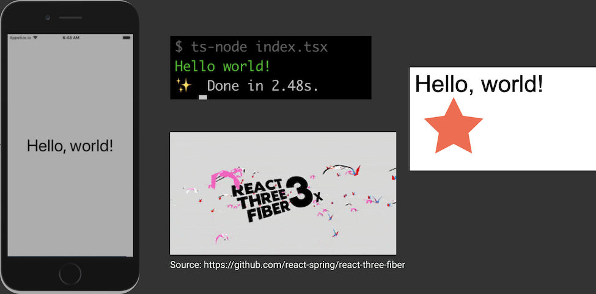

<!-- note
次にカスタムレンダラーについて見ていきましょう

React is not only for DOM.
So I'm going to describe how to create a custom renderer!
-->

# React Custom Renderer

----------------------

<!-- note
これらは全てカスタムレンダラーで作られています

Before explaining Custom Renderer, I'd like to introduce existing renderers.

As I'm sure you know we have `react-native`, `react-test-renderer`.
and other renderers for various environments.

I'd like to introduce those renderers briefly.
-->

# Renderers



----------------------

<!-- note
Ink is a custom renderer for CLI output.
This makes it easy to create interactive command line applications.
-->

# Ink

```js
import React from 'react';
import {render, Box, Color} from 'ink';

render(
  <Box>
      <Color green>Hello world!</Color>
  </Box>
);
```

----------------------

<!-- note
React Konva is a custom renderer for Canvas.
This makes it possible to draw canvas graphics declaratively.
-->

# ReactKonva

```js
ReactKonva.render(
    <Stage width={300} height={300}>
      <Layer>
        <Text text="Hello, world!" fontSize={30} />
        <Star
          x={50}
          y={70}
          innerRadius={20}
          outerRadius={40}
          fill="tomato"
        />
      </Layer>
    </Stage>,
    el
);
```

---------------

<!-- note
React Three Fiber is a custom renderer for Three.js.
This makes it possible to draw 3D graphics declaratively.
-->

# ReactThreeFiber

```js
import React, { useRef } from 'react'
import ReactDOM from 'react-dom'
import { Canvas, useFrame } from 'react-three-fiber'

const Cube = () => {
    const ref = useRef()
    useFrame(() => (ref.current.rotation.x = ref.current.rotation.y += 0.01))
    return (
        <mesh ref={ref}>
            <boxBufferGeometry attach="geometry" args={[1, 1, 1]} />
            <meshNormalMaterial attach="material" />
        </mesh>
    )
}
ReactDOM.render(<Canvas><Cube /></Canvas>, el);
```


---------------

<!-- note
これはASTを扱う面白いレンダラーです

React AST is a custom renderer for AST. Interesting, right?

You can define an abstract syntax tree declaratively as JSX.
This can generate source code and an AST object from JSX.

I'm not sure whether it's useful or not.
But It's fun!
-->

# ReactAST

```js
import React from 'react';
import {
    renderAst,
    Code,
    ClassDeclaration,
    FunctionDeclaration
} from 'react-ast';

const ast = renderAst(
    <ClassDeclaration name="Hello" superClassName="Array">
        <Code>const hello = 'world'</Code>
        <FunctionDeclaration name="foo">
            <Code>return 'bar'</Code>
        </FunctionDeclaration>
    </ClassDeclaration>
);

console.log(ast);
```

---------------
<!-- note
カスタムレンダラーはDOM環境に対しても有用です。

Custom renderer is useful even for DOM environment.
If you feel that the size of React DOM is too big.
You can create a lightweight React DOM implementation as a custom renderer like ReactDOMLite.

If you are interested in creating a custom renderer for DOM.
I recommend watching the video of Sophie's talk at this year's React Conf.

Before going over React custom renderer, I'd like to introduce the architecture of React.
-->

# Building a Custom React DOM Renderer

- https://github.com/jquense/react-dom-lite
- https://conf.reactjs.org/event.html?sophiebits

---------------


<!-- note
これはReactのアーキテクチャを示した図です

This is an overview of the architecture of React.

Component is a layer to define components.
Host components are provided by a renderer.
these components start with a lower case and they are processed by a renderer.

Reconciler is a layer of React core.
It manages updates and call functions of a host config and it enables many features like Hooks, Suspense, and Concurrent Mode.

Finally, Renderer is a layer for a host environment.
So when we create a custom renderer, we have to implement this.

In other words, you can use Hooks, Suspense, and Concurrent Mode on your custom renderer without implementing them yourself.

If you are interested in the architecure, you can see my slide, "Algorithms in React".
-->

# Architecture of React


- https://speakerdeck.com/koba04/algorithms-in-react

---------------

<!-- note
ここからはカスタムレンダラーを作る方法を見ていきます。

Ok, It's time to imeplement a custom renderer!

First, we have to install `react-reconciler` package from npm.
-->

# react-reconciler

```shell
npm install react-reconciler
```

[packages/react-reconciler](https://github.com/facebook/react/tree/master/packages/react-reconciler)


---------------

<!-- note
ここではレンダラーを作っています

And then, we can create a renderer by passing a host config to the reconciler.

After creating a renderer, we create a container.
And then, we update the container to render the passed element.

`createContainer` doesn't render anything. `updateContainer` does.
`updateContainer` processes the passed ReactElement.
If we pass the same `fiberRoot` to `updateContainer`, this is processed as an update.

Next, let's see the host config interface.
-->

# How to use

```js
import Reconciler from "react-reconciler";

const renderer = Reconciler(hostconfig);

export const YourReact = {
  render(
    element: React.ReactNode,
    rootContainer: RootContainer,
    callback = () => {}
  ) {
    if (!rootContainer.container) {
      rootContainer.container = {}
      rootContainer.container.fiberRoot = renderer.createContainer(
        container,
        false,
        false
      );
    }
    renderer.updateContainer(element, container.fiberRoot, null, callback);
  }
}
```

---------------

<!-- note
これらはHostConfigとして実装するAPIです

You have to implement many functions to create a custom renderer.
Here is the interface.

The first part is the interface you must implement.
The second part is an optional interface for mutation.
We have to implement both if we'd like to use a mutation mode.

Number 1 means that there is a Number 2...
Yes, there is more.
-->

# HostConfig Interface \#1


> getPublicInstance, getRootHostContext, getChildHostContext, prepareForCommit, resetAfterCommit, createInstance, appendInitialChild, finalizeInitialChildren, prepareUpdate, shouldSetTextContent, shouldDeprioritizeSubtree, createTextInstance scheduleDeferredCallback, cancelDeferredCallback, setTimeout, clearTimeout, noTimeout, now, isPrimaryRenderer supportsMutation, supportsPersistence, supportsHydration


### Mutation(optional)

> appendChild, appendChildToContainer, commitTextUpdate, commitMount, commitUpdate, insertBefore, insertInContainerBefore, removeChild, removeChildFromContainer,  resetTextContent

---------------

<!-- note
Let's move on to Number 2.
The first part includes an optional interface for persistence mode.
If you'd like to impelement your custom renderer as persistence mode, you have to implement this interface.
The persistence mode is a mode to treat its instance as immutable.
React Native is working on a new architecture called Fabric, which uses Persistence mode.

The second part is an optional interface for hydration.
If you'd like to support hydration on your renderer, you have to implement this interface.
ReactDOM is implemented by these functions.

I won't be going into detail about Persistence and Hydration mode in this talk.
So if you are interested in them, please have a look at the host configs of ReactNativeFabric and ReactDOM.
-->

# HostConfig Interface \#2

### Persistence(optional)

> cloneInstance, createContainerChildSet, appendChildToContainerChildSet, finalizeContainerChildren, replaceContainerChildren


### Hydration(optional)

> canHydrateInstance, canHydrateTextInstance, getNextHydratableSibling, getFirstHydratableChild, hydrateInstance hydrateTextInstance,didNotMatchHydratedContainerTextInstance, didNotMatchHydratedTextInstance, didNotHydrateContainerInstance, didNotHydrateInstance,didNotFindHydratableContainerInstance, didNotFindHydratableContainerTextInstance, didNotFindHydratableInstance, didNotFindHydratableTextInstance

*from @types/react-reconciler*

---------------

<!-- note
たくさんあって複雑そうですが、空の関数で大丈夫なことも多いです

Does it seems to be too complecated?
I understand...
But you don't have to impelement all functions!!
Many functions might be ok as empty functions.

You can impelement the functions incrementally.
-->

# 😇

----------------------

<!-- note
既存のレンダラーのHostConfigはとても参考になります。

These are host configs of renderers I've introduced.
So I recommend checking them when implementing a custom renderer.
-->

# HostConfig of renderers

- ReactDOM
    - [packages/react-dom/src/client/ReactDOMHostConfig.js](https://github.com/facebook/react/blob/master/packages/react-dom/src/client/ReactDOMHostConfig.js)
- ReactNative
    - [packages/react-native-renderer/src/ReactNativeHostConfig.js](https://github.com/facebook/react/blob/master/packages/react-native-renderer/src/ReactNativeHostConfig.js)
    - [packages/react-native-renderer/src/ReactFabricHostConfig.js](https://github.com/facebook/react/blob/master/packages/react-native-renderer/src/ReactFabricHostConfig.js)
- ReactTestRenderer
    - [packages/react-test-renderer/src/ReactTestHostConfig.js](https://github.com/facebook/react/blob/master/packages/react-test-renderer/src/ReactTestHostConfig.js)
- Ink
    - [vadimdemedes/ink/blob/master/src/reconciler.js](https://github.com/vadimdemedes/ink/blob/master/src/reconciler.js)
- ReactKonva
    - [konvajs/react-konva/blob/master/src/ReactKonvaHostConfig.js](https://github.com/konvajs/react-konva/blob/master/src/ReactKonvaHostConfig.js)

----------------------

<!-- note
ここでは、HostConfigに何を実装するのかを説明します

What do we implement on the host config?
Side-effects, Defining instances and mode, Hydration logic if you need it.

Let's go over them.
-->

# HostConfig?

- Side effects for a Host environment
- Define instances
- Define the mode for a renderer
- Hydration logic (if you need)

---------------
<!-- note
ReactDOMはこれをinsertBeforeで実装します

Before describing a host config, let's look at an example.
This changes the order of item b from second to first.

React determines the change by the key props.
ReactDOM processes this change as an insertBefore function.

What if we implement the function as a custom renderer?
-->
# Side effects for a Host environment

```js
ReactDOM.render(
    <ul>
        <li key="a">a</li>
        <li key="b">b</li>
        <li key="c">c</li>
    </ul>,
    container
);

ReactDOM.render(
    <ul>
        <li key="b">b</li>
        <li key="a">a</li>
        <li key="c">c</li>
    </ul>,
    container
)
// React update the DOM like the following
// li.insertBefore(b, a);
```

----------------------

<!-- note
HostConfigのAPIはDOMと似ています

The APIs for side effects are very similar with DOM APIs.
So if you are familar with DOM APIs, you can understand them easily.

we implement the function as the insertBefore function like this.
when implmenting a custom renderer, writing imperative operations is your job.
-->

# insertBefore

```js
export function insertBefore(
  parentInstance: Instance,
  child: Instance | TextInstance,
  beforeChild: Instance | TextInstance
): void {
  // we have to remove a current instance at first
  const index = parentInstance.children.indexOf(child);
  if (index !== -1) {
    parentInstance.children.splice(index, 1);
  }
  // And then, we insert the instance into a new index
  const beforeIndex = parentInstance.children.indexOf(beforeChild);
  parentInstance.children.splice(beforeIndex, 0, child);
}
```

----------------------

<!-- note
多くのAPIは名前から想像できます。commitMountだけ呼ばれる条件に注意が必要です。

You can imagine the implementation of many functions from the name.
But there is a caveat for commitMount.

commitMount is only called when finalizeInitialChildren returns true.
ReactDOM uses the function to implement autoFocus attribute.
ReactDOM returns true from finalizeInitialChildren if the tag is button, input, select, or textarea and autoFucos prop is true.
-->

# Others

- appendChild, appendInitialChild, appendChildToContainer
- commitTextUpdate, commitMount, commitUpdate
- insertBefore, insertInContainerBefore
- removeChild, removeChildFromContainer, resetTextContent

---------------

<!-- note
これはインスタンスを構築するためのAPIです。

Let's move on to the defining instance.

createInstance and createTextInstance are important, they return an instance that we use in the host config.
You can return any value as an instance.

ReactDOM uses DOM APIs like createElement and createTextNode for these functions.
So ReactDOM returns a DOM node from the functions.
-->

# createInstance, createTextInstance

```js
export function createInstance(
  type: Type,
  props: Props,
  rootContainerInstance: Container,
  hostContext: HostContext,
  internalInstanceHandle: OpaqueHandle
): Instance {
  return createYourHostInstance(type, props);
}

export function createTextInstance(
  text: string,
  rootContainerInstance: Container,
  hostContext: HostContext,
  internalInstanceHandle: OpaqueHandle
): TextInstance {
  return createYourTextInstacne(text);
}
```

---------------

<!-- note
getPublicInstance is a function to define a public instance, which receives an instance and returns a public instance.
you can convert an instance to what you want to expose.

ReactDOM returns a received instance without doing anything.
So you can get a DOM node reference through a `ref` prop.
-->

# getPublicInstance

```js
export function getPublicInstance(
  instance: Instance
): PublicInstance {
  return convertToPublicInstance(instance);
  // react-dom
  // return instance;
}
```

---------------

<!-- note
These are flags to determine how your custom renderer works.
-->

# Define the mode for a renderer

```js
export const isPrimaryRenderer = true;
export const supportsMutation = true;
export const supportsPersistence = false;
export const supportsHydration = false;
```

---------------
<!-- note
カスタムレンダラーのHostComponentの型定義もできます

For TypeScript users, you can define type definition for your host components like this.
You can override type definition for IntrisicElements.

OK, let's move on to the final part.
Live coding.
-->

# Type Definition for custom host config

```js
declare namespace JSX {
  interface IntrinsicElements {
    text: {
      color: string;
      children?: React.ReactNode;
    };
  }
}
```

https://www.typescriptlang.org/docs/handbook/jsx.html#intrinsic-elements
