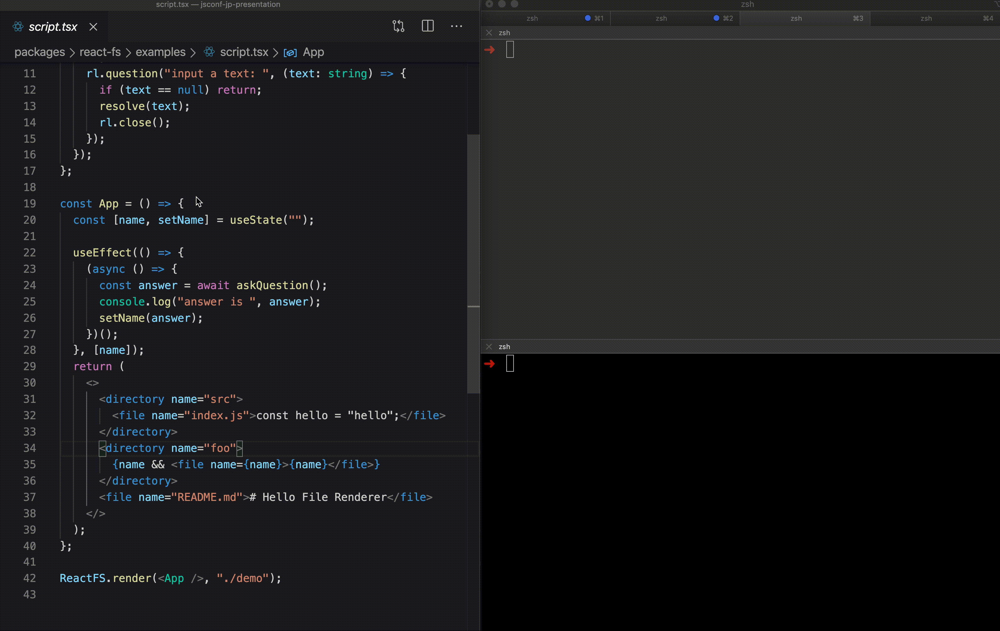

<!-- note
ここからはライブコーディングです。
ここでは、FileSystemを扱うカスタムレンダラーを作成します

Let's take a look at this image, This is a custom renderer that I'm going to create.
This is a custom renderer for file system.

This example creates README.md and index.js in a src directory.
This also receives user inputs and creates a file from the input value.
-->

# Live Coding

